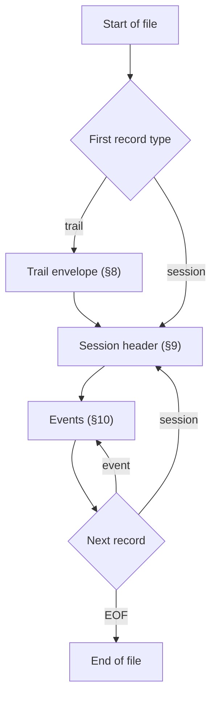

## 5. File format

### 5.1 File extension and MIME type

- Recommended extension: `.trail.jsonl`
- Native compressed extension: `.trail.jsonl.gz`
- MIME type: `application/vnd.trail+jsonl`. The `vnd.` form is the intended canonical type and follows IANA conventions for vendor MIME types. IANA registration is deferred to v1.0; until then the type is documented here but not officially registered.
- Native compressed MIME type: `application/vnd.trail+jsonl+gzip`.
- The `+jsonl` suffix is provisional rather than an IANA-registered structured syntax suffix, and `+jsonl+gzip` is a nonstandard double suffix; these media types may be revised during registration.
- Editors render as JSON via the `.jsonl` suffix. A dedicated language extension MAY provide richer highlighting later.

### 5.2 Encoding

- UTF-8, no BOM.
- LF line endings (`\n`). CRLF is tolerated by readers; writers MUST NOT produce it.
- Each line is one self-contained JSON object.
- Empty lines are not allowed.
- A trailing newline at EOF is recommended but not REQUIRED.
- Writers MUST replace invalid UTF-8 bytes and unpaired surrogate escapes with U+FFFD at emission time. Emitted JSON strings MUST NOT contain unpaired surrogates.
- Writers MUST NOT emit JSON integer numbers outside the IEEE-754 exact-integer range (`-(2^53-1)` through `2^53-1`) anywhere in a trail file. Adapters that receive oversized source integers, such as snowflake ids or nanosecond timestamps in `source.raw`, MUST emit them as strings instead. Validator warnings use code `non_interoperable_number` at the offending JSON Pointer.
- `.trail.jsonl.gz` files are a whole-file gzip wrapper around the UTF-8 trail JSONL bytes above. Writers MUST NOT gzip individual JSONL lines independently. Readers MUST decompress `.trail.jsonl.gz` files before validation and processing.
- For `.trail.jsonl.gz`, `content_hash` is computed and verified by first decompressing the file to produce plain UTF-8 JSONL, then applying the canonical bytes procedure defined in [§7.3](./07-identity-artifacts-and-content-addressing.md#73-content-hash) to the decompressed JSONL. The compressed bytes themselves are never hashed.

### 5.3 File layout

Every valid trail file has:

1. **Optionally**, a trail envelope (`type:"trail"`) on line 1 ([§8](./08-the-trail-envelope.md#8-the-trail-envelope)).
2. One **or more** session header groups in file order. Each group starts with a `type:"session"` record and continues with zero or more event lines until the next `type:"session"` record or EOF ([§9.6](./09-the-session-header.md#96-multi-session-trail-files)). The first session header MUST appear on line 1 when there is no envelope, or on line 2 when an envelope is present.

When the file contains exactly one group, behaviour is unchanged from earlier drafts. Multi-group ("multi-session") files are described in [§9.6](./09-the-session-header.md#96-multi-session-trail-files).

> Non-normative diagram.

---

