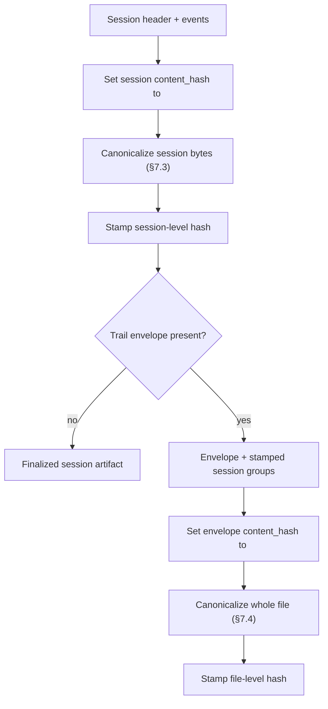

## 7. Identity, artifacts, and content addressing

### 7.1 Session identity

Every session has a local identifier `id` in the header. Writers emit uppercase ULIDs (26 Crockford base32 chars) or lowercase UUIDs (RFC 4122, hyphenated or unhyphenated). The schema enforces this canonical casing so cross-segment reconciliation can dedup events by exact string equality; older v0.1 fixtures whose ids were free-form strings or non-canonical casing have been migrated.

### 7.2 Artifact classes

Agent Trail distinguishes local fidelity from shared safety:

- **Raw trail:** the local artifact emitted by an adapter. It SHOULD preserve source fidelity, including `source.raw` where useful and safe.
- **Redacted trail:** a separate artifact produced from a raw trail for sharing. It removes or normalizes sensitive content and has its own `content_hash`.
- **Shared trail:** a redacted trail transported by a share tool.

Redacted artifacts MAY include `redacted_from.content_hash` in the header to record provenance from the raw artifact. They MUST NOT expose the raw artifact's local path or local session identifier.

### 7.3 Content hash

Finalized artifacts SHOULD populate `content_hash` in the header. This is the SHA-256 of the artifact's canonical bytes, not a hash of the physical on-disk serialization and not a logical-session identifier shared across raw and redacted variants.

Canonical bytes are defined as:

- All JSONL lines in order.
- LF line endings.
- No trailing whitespace.
- A trailing newline at EOF.
- Each JSON object serialized using RFC 8785 JSON Canonicalization Scheme (JCS).
- Writer-valid strings are well-formed per §5.2, so canonical bytes remain pure JCS; hash-time string repair is not part of this procedure.

Because the hash depends on the file content that includes the hash field, we use a two-pass approach:

1. Serialize the file with the header's `content_hash` field set to the literal `"<pending>"`. If the field is absent, insert `content_hash:"<pending>"` into the header before canonicalization; this gives stamped and unstamped forms one digest for the same logical content.
2. Canonicalize per the rules above.
3. Compute SHA-256 of the canonicalized bytes.
4. Replace only the header's `content_hash` field with the resulting hex digest.

Verifying a file's hash uses the same procedure: replace the present hash with `"<pending>"`, canonicalize, hash, compare.

Writers that produce streaming or in-progress files MAY omit `content_hash` or leave it as `"<pending>"`. Readers MAY verify the hash but MUST NOT abort on mismatch — only warn. Strict validators MUST report a present but incorrect finalized `content_hash` as an error.

### 7.4 Two-tier identity

When a trail envelope is present, the file carries two independent content hashes:

- **Session-level `content_hash`** lives on the session header. It is SHA-256 over the canonical bytes covering only the session header and its events (the envelope record is excluded from the hashed input). In a multi-session file (§9.6) the slice for a session covers that session's header and the events between it and the next `type:"session"` record (or EOF). This makes each session's identity independent of whether it is wrapped in an envelope or sits beside sibling sessions — extracting one session from a multi-session file recomputes the same digest.
- **File-level `content_hash`** lives on the trail envelope. It is SHA-256 over the canonical bytes of the whole file, with the envelope's `content_hash` field replaced by `"<pending>"` per the same two-pass procedure as §7.3. The session-level `content_hash`, if already populated, is treated as opaque file content.

Writers that emit both hashes MUST stamp every session-level hash first, then compute and stamp the file-level hash. Readers verify them independently. Different consumers care about different scopes: extraction tools recompute the session hash; share/transport tools verify the file hash.

> Non-normative diagram.

#### 7.4.1 Hash tier for `fork_from` and `redacted_from`

Lineage references mirror the tier of the linking context:

- **Header-level `fork_from.content_hash` and `redacted_from.content_hash`** refer to the **session-level** `content_hash` of the parent artifact (the forked-from session or the raw session that was redacted). This keeps session lineage independent of any envelope wrapper — extracting either side recomputes the same digest.
- **Envelope-level `fork_from.content_hash` and `redacted_from.content_hash`** refer to the **file-level** `content_hash` of the parent file (envelope and all sessions included). Use these to link whole files rather than individual sessions.
- `segment.prev_content_hash` (§9.5) is always session-level, since segments chain at session grain.

Writers MUST choose the matching tier; mixing tiers across a chain breaks verification.

### 7.5 Event identifiers

Event `id` values are globally unique. Writers emit uppercase ULIDs or lowercase UUIDs, matching §7.1 and the schema. Globally-unique canonical ids let a reconciler dedup events across segments by exact string equality.

---

