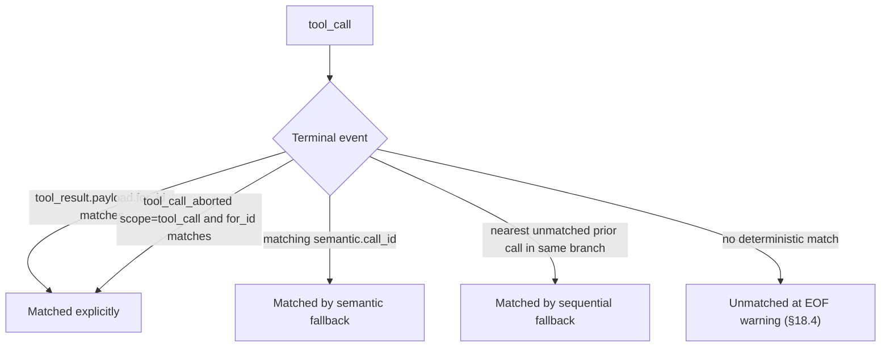

## 10. Events

### 10.1 Base shape

Every event entry has this base shape:

```jsonc
{
  "type": "<event-type>",
  "id": "<entry-id>",
  "parent_id": "<entry-id>",                    // optional; tree topology only
  "ts": "<ISO-8601 timestamp>",
  "payload": { /* type-specific */ },
  "semantic": {                                 // optional; see §10.4
    "group_id": "<group-id>",
    "call_id": "<source-call-id>",
    "tool_kind": "<canonical-tool-kind>"
  },
  "source": {                                   // optional
    "agent": "<canonical-agent-name>",
    "original_type": "<source-event-name>",
    "schema_version": "<source-schema-version>",
    "raw": { /* opaque source object; see §10.6 and §15 */ },
    "synthesized": false
  },
  "meta": {                                     // optional; vendor extensions (§8.3 / §12)
    "x-example/field": "..."
  }
}
```

| Field | Required | Type | Notes |
|---|---|---|---|
| `type` | yes | string | event type; see §10.2-10.3 |
| `id` | yes | string | globally unique; ULID or UUID per §19 |
| `parent_id` | no | string | references another `id` for tree topology; absent = linear file order |
| `ts` | yes | string | ISO-8601 timestamp |
| `payload` | yes | object | type-specific data |
| `semantic` | no | object | linking metadata for fallback pairing |
| `source` | no | object | adapter-provided source metadata |
| `meta` | no | object | vendor extensions (§8.3 / §12) |

### 10.2 Mandatory event types

Every adapter MUST be able to emit these when the source data contains the corresponding semantics. Readers MUST support them.

#### `user_message`

A user-role message. By default this is text typed by the human user; `payload.origin` marks runtime-injected or mixed user-role content.

```jsonc
{
  "type": "user_message",
  "id": "...",
  "ts": "...",
  "payload": {
    "text": "How do I parse a CSV in Python?",
    "attachments": [
      { "kind": "image", "media_type": "image/png", "uri": "<inline-or-ref>" }
    ]
  }
}
```

| Payload field | Required | Type | Notes |
|---|---|---|---|
| `text` | yes | string | the user's input |
| `origin` | no | enum or extension | `user`, `injected`, `mixed`, or `x-<vendor>/<name>`. Absent means `user`. |
| `attachments` | no | array | images or files by reference |

`origin:"user"` means the text was typed by the human. `origin:"injected"` means runtime-injected content (system reminders, attached-file blobs, hook output) carried as a user-role message. `origin:"mixed"` means both human-authored and injected content appear in one body. Structured part-level decomposition is deferred.

Attachment entries require `kind` plus at least one of `uri` or `name`. `uri` values in v0.1.0 are references, not inline binary payloads. Writers MAY use `https:`, local `file:` references for private/local trails, or content-addressed references such as `sha256:<hex>`. Plain `http:` is deliberately excluded to avoid unauthenticated network fetches in shared trails. Inline `data:` payloads are deferred.

#### `agent_message`

A text response from the agent.

```jsonc
{
  "type": "agent_message",
  "id": "...",
  "ts": "...",
  "payload": {
    "text": "You can use pandas:",
    "model": "claude-sonnet-4-5",
    "stop_reason": "end_turn",
    "usage": {
      "input_tokens": 1234,
      "output_tokens": 567,
      "cache_read_tokens": 100,
      "cache_creation_tokens": 50,
      "reasoning_tokens": 200,
      "context_input_tokens": 1384,
      "context_window_tokens": 200000
    }
  }
}
```

| Payload field | Required | Type | Notes |
|---|---|---|---|
| `text` | yes | string | the agent's output |
| `model` | no | string | model that produced this message |
| `stop_reason` | no | string | source-specific stop reason |
| `usage` | no | object | token usage for the source envelope; see below |
| `attachments` | no | array | agent-side images or files by reference (e.g. a generated chart or vision output); same object shape as `user_message.payload.attachments` |

`stop_reason` is source-specific and remains an opaque string. Writers SHOULD use this RECOMMENDED vocabulary when it matches the source semantics: `end_turn`, `max_tokens`, `tool_use`, `refusal`, `error`, `aborted`. Source-specific values remain legal; readers MUST treat unknown values as opaque.

`attachments[]` entries share one object shape across `user_message`, `agent_message`, and `tool_result` (`kind` ∈ `image`/`file`/`other`, optional `media_type`, and at least one of `uri` or `name`). The same v0.1.0 `uri` reference policy applies: `https:`, local `file:`, or content-addressed `sha256:`; inline `data:` payloads are deferred.

##### `agent_message.payload.usage`

Captures token accounting emitted by the source agent for a model-response envelope. Optional. When the source provides no token data, writers MUST omit `usage` — fabricating zeros is not allowed.

| Sub-field | Required | Type | Notes |
|---|---|---|---|
| `input_tokens` | conditional | integer ≥0 | delta for this envelope |
| `output_tokens` | conditional | integer ≥0 | delta for this envelope |
| `input_tokens_cumulative` | conditional | integer ≥0 | running total through this envelope |
| `output_tokens_cumulative` | conditional | integer ≥0 | running total through this envelope |
| `total_tokens` | conditional | integer ≥0 | source-reported inclusive total for this envelope |
| `total_tokens_cumulative` | conditional | integer ≥0 | source-reported inclusive running total through this envelope |
| `cache_read_tokens` | no | integer ≥0 | input tokens served from prompt cache; billed separately from `input_tokens` |
| `cache_creation_tokens` | no | integer ≥0 | input tokens written to prompt cache; billed separately from `input_tokens` |
| `reasoning_tokens` | no | integer ≥0 | output reasoning portion (Anthropic thinking, OpenAI reasoning) |
| `context_input_tokens` | no | integer ≥0 | prompt/context tokens submitted to the model for this request; cache-inclusive when the source exposes enough detail |
| `context_window_tokens` | no | integer ≥1 | model context-window size for this request, only when the source exposes it |

When `usage` is present, writers MUST emit either input/output coverage or total-token coverage. Input/output coverage means at least one of (`input_tokens`, `input_tokens_cumulative`) AND at least one of (`output_tokens`, `output_tokens_cumulative`). Total-token coverage means at least one of (`total_tokens`, `total_tokens_cumulative`). These shapes are supported because sources differ. Readers SHOULD prefer delta fields and fall back to subtracting consecutive cumulative values.

Total token semantics: `total_tokens` and `total_tokens_cumulative` are source-reported inclusive totals for exact total-token analytics. Writers MUST NOT fabricate total-token fields by summing buckets. Readers that need exact total counts SHOULD prefer `total_tokens`, fall back to deriving a delta from consecutive `total_tokens_cumulative` values, and only then fall back to summing known bucket fields.

Cache token semantics: `input_tokens` counts non-cached input only; `cache_read_tokens` and `cache_creation_tokens` are independent billing categories. Total billed input = `input_tokens + cache_read_tokens + cache_creation_tokens`. They are additive, not a subset of `input_tokens`.

Context token semantics are for context-pressure analytics, not billing. Writers MAY emit `context_input_tokens` when the source exposes prompt/context tokens for the request, including cache-read and cache-creation tokens when those count against the context window. Writers MAY emit `context_window_tokens` when the source reports the model's positive context-window size for the request. Writers MUST NOT estimate either field from raw text or tokenizer assumptions, and MUST NOT fabricate a `context_window_tokens` value from model name alone. Consumers derive context pressure as `context_input_tokens / context_window_tokens` when both fields are present; otherwise the ratio is unavailable.

Model identification for downstream cost analysis uses `payload.model` first, falls back to `header.agent.model_default`, and is otherwise unknown. The `usage` object does not carry its own model field.

When a single source envelope fans out to multiple entries (text blocks, tool calls, thinking blocks sharing one API response), `usage` accounts for the whole envelope. Writers MUST attach it to the first derived entry whose payload supports `usage`, skip non-usage-capable derived entries, and MUST NOT repeat it on later derived entries. In v0.1.0, `usage` is valid on `agent_message`, `agent_thinking`, and `tool_call` payloads; if an envelope emits none of those entries, canonical `usage` is omitted.

Monetary cost is intentionally not a canonical trail field or event. Analyzers compute cost from token usage, model identification, and their own pricing tables, and carry pricing provenance such as currency, pricing source, and effective date in analyzer output. If a source exposes a billing estimate, writers MAY preserve it as opaque source data under `x-<vendor>/<name>` keys on the entry's `meta` field (§8.3). Latency and wall-clock telemetry are deferred to a future minor version; sources rarely expose them consistently.

#### `task_plan_update`

The agent emitted a checklist or plan snapshot. This is the canonical representation for structured planning state. Writers MUST NOT represent these snapshots as `tool_call.payload.tool:"task_plan"`.

```jsonc
{
  "type": "task_plan_update",
  "id": "...",
  "ts": "...",
  "payload": {
    "explanation": "optional note",
    "items": [
      {
        "id": "item-1",
        "content": "Write failing test",
        "status": "in_progress",
        "active_form": "Writing failing test"
      }
    ],
    "deltas": [
      {
        "kind": "status_changed",
        "item_id": "item-1",
        "from_status": "pending",
        "to_status": "in_progress"
      }
    ]
  }
}
```

| Payload field | Required | Type | Notes |
|---|---|---|---|
| `explanation` | no | string | source-provided explanation for this plan update, when present |
| `items` | yes | array | full current snapshot of plan items |
| `deltas` | no | array | best-effort differences from the previous `task_plan_update` in the same source session |

Each `items[]` entry has:

| Item field | Required | Type | Notes |
|---|---|---|---|
| `id` | yes | string | upstream item id if present; otherwise a deterministic adapter-synthesized id |
| `content` | yes | string | human-readable task text |
| `status` | yes | string | one of `pending`, `in_progress`, `completed`, `cancelled`, `blocked` |
| `active_form` | no | string | source-provided active/progressive wording |

When the upstream source does not provide item ids, or provides empty or whitespace-only strings, adapters SHOULD synthesize deterministic ids. Empty and whitespace-only item ids are treated as missing. The synthesized id is derived per source session from normalized content plus that content's duplicate occurrence position in the snapshot. With synthesized ids, status deltas are reliable when normalized content remains stable; content changes are best-effort because the source did not provide stable identity.

`deltas[]` entries are optional. When present, each has `kind` and `item_id` plus fields determined by `kind`:

| Delta kind | Required fields |
|---|---|
| `added` | `to_content`, `to_status` |
| `removed` | `from_content`, `from_status` |
| `status_changed` | `from_status`, `to_status` |
| `content_changed` | `from_content`, `to_content` |

`added` MAY include `to_active_form`; `removed` MAY include `from_active_form`. Sources that only report plan-completed notifications with no item status snapshot SHOULD preserve them as `system_event` records instead of inventing checklist state.

#### `tool_call`

The agent invoked a tool. Tool kinds use the taxonomy in [§11](./11-canonical-tool-taxonomy.md#11-canonical-tool-taxonomy).

```jsonc
{
  "type": "tool_call",
  "id": "...",
  "ts": "...",
  "payload": {
    "tool": "file_read",
    "args": { "path": "package.json" },
    "truncated": false,
    "args_size": 23,
    "overflow_ref": null
  },
  "semantic": {
    "call_id": "toolu_01abc"
  }
}
```

| Payload field | Required | Type | Notes |
|---|---|---|---|
| `tool` | yes | string | canonical tool kind ([§11](./11-canonical-tool-taxonomy.md#11-canonical-tool-taxonomy)) |
| `args` | yes | object | tool-specific args |
| `truncated` | no | boolean | true when `args` is a bounded excerpt rather than complete tool arguments |
| `args_size` | conditional | integer | original serialized argument byte size; REQUIRED when `truncated: true` |
| `overflow_ref` | no | string or null | optional content-addressed reference to full argument bytes when `args` is truncated; writer-strict values use `sha256:<64 lowercase hex>` |
| `usage` | no | object | token usage when this is the first entry derived from a source envelope; see [`payload.usage`](#agent_messagepayloadusage) |

#### `tool_result`

The result of a `tool_call`. References the call via `for_id`. Writers omit `for_id` when the source does not provide a reliable match. Readers MAY tolerate legacy/null values; when `for_id` is null or missing, see [§10.5](#105-tool-call-terminal-pairing).

```jsonc
{
  "type": "tool_result",
  "id": "...",
  "ts": "...",
  "payload": {
    "for_id": "<tool-call-id>",
    "ok": true,
    "output": "<truncated-or-full>",
    "truncated": false,
    "output_size": 12345,
    "overflow_ref": null,
    "error": null
  },
  "semantic": {
    "call_id": "toolu_01abc",
    "tool_kind": "file_read"
  }
}
```

| Payload field | Required | Type | Notes |
|---|---|---|---|
| `for_id` | no | string | id of the matching `tool_call`; omit when unknown |
| `ok` | yes | boolean | did the call succeed |
| `output` | no | string | textual output |
| `truncated` | no | boolean | true if `output` was truncated |
| `output_size` | no | integer ≥0 | UTF-8 byte length of the original output before truncation; REQUIRED when `truncated` is true |
| `overflow_ref` | no | string | reference to full output |
| `error` | no | string | error message if `ok` is false |
| `attachments` | no | array | non-MCP image / multi-part tool output by reference (e.g. a screenshot or plot tool returning an image that `output` flattens); same object shape as `user_message.payload.attachments` |
| `meta` | no | object | structured per-toolkind outputs; see below |

`attachments[]` on `tool_result` carries image or binary results from tools whose output `output` (a display string) cannot represent — typically `tool: "other"` kinds such as a screenshot or plotting tool. MCP tools instead preserve their native block structure in `meta.mcp_call.content_blocks` (below); `attachments[]` is the generic escape hatch for everything else.

#### `tool_call_aborted`

The agent attempted or began a tool invocation, but the invocation was cancelled, blocked, timed out, denied, or otherwise stopped without a normal `tool_result`. Use this instead of inventing a failed `tool_result` when the source evidence says no result was produced.

```jsonc
{
  "type": "tool_call_aborted",
  "id": "...",
  "ts": "...",
  "payload": {
    "scope": "tool_call",
    "reason": "hook_blocked",
    "for_id": "<tool-call-id>",
    "blocked_by": "PreToolUse:Bash"
  }
}
```

| Payload field | Required | Type | Notes |
|---|---|---|---|
| `scope` | yes | enum or extension | `tool_call` when a specific call is known; `turn` when the source only proves a turn-level abort. Extensions MUST use `x-<vendor>/<name>`. |
| `reason` | yes | enum or extension | One of `user_interrupt`, `hook_blocked`, `timeout`, `permission_denied`, `runtime_error`, or `x-<vendor>/<name>`. |
| `for_id` | when `scope:"tool_call"` | string | id of the matching `tool_call`; omitted for `scope:"turn"` and other non-call-specific scopes. |
| `blocked_by` | no | string | hook, policy, permission system, or runtime component that stopped the call. |

Bare unknown `scope` and `reason` values are writer-strict errors. Readers are tolerant of unknown `x-*` extension values.

##### `tool_result.payload.meta` — structured outputs

`output` is a display string. When the source tool returned structured data, writers MAY also
populate `meta`, an object keyed by the originating `tool_call.tool` (the canonical tool kind, [§11](./11-canonical-tool-taxonomy.md#11-canonical-tool-taxonomy)).
Consumers that understand a kind read `meta.<toolKind>`; everyone else falls back to `output`. `meta`
is optional and additive — existing writers that emit only `output` stay valid.

Registered keys are writer-strict (unknown fields inside a registered shape are rejected). Vendors
extend a registered tool kind by adding sibling keys to its object that match the `x-<vendor>/`
pattern (e.g. `meta.mcp_call.x-acme/cache_hit`). Unregistered and future tool kinds are accepted as
opaque objects, so new kinds can be standardized in a later minor version without a schema migration.

The v0.1 registry covers three tool kinds:

`meta.mcp_call` — preserves MCP content-block structure that `output` flattens.

| Sub-field | Required | Type | Notes |
|---|---|---|---|
| `content_blocks` | no | array | MCP content blocks; each block has `type` (`text`/`image`/`resource`) plus `text`/`data`/`mime_type`/`uri` as applicable |
| `is_error` | no | boolean | MCP-protocol error flag. Distinct from envelope `payload.ok`: `is_error` is the tool's own success signal, `ok` is the trail-level call outcome |

`meta.file_read` — read range and truncation metadata.

| Sub-field | Required | Type | Notes |
|---|---|---|---|
| `range` | no | array | `[start_line, end_line]` requested |
| `total_lines` | no | integer ≥0 | total lines in the file |
| `encoding` | no | string | detected/used encoding |
| `truncated_at_line` | no | integer ≥0 \| null | line where output was cut, or null if untruncated |

`meta.shell_command` — separated streams and exit status.

| Sub-field | Required | Type | Notes |
|---|---|---|---|
| `stdout` | no | string | standard output stream |
| `stderr` | no | string | standard error stream |
| `exit_code` | no | integer \| null | process exit code; null when terminated by signal |
| `signal` | no | string \| null | terminating signal (e.g. `SIGKILL`), or null |
| `duration_ms` | no | integer ≥0 | wall-clock duration |

`meta.shell_command.exit_code` is the canonical home for shell exit status; there is no generic
top-level `exit_code` on `tool_result`, because the concept does not apply to kinds like `mcp_call`
or `web_fetch`.

Privacy: `meta` carries the same raw content as `output` (shell stdout, MCP block text), so the
redaction pipeline scrubs `meta` string leaves alongside `output` (§16).

#### `user_query`

The agent asks the user one or more structured questions and yields control until the user answers or dismisses the prompt. This is not a `tool_call`: no external tool executes.

```jsonc
{
  "type": "user_query",
  "id": "...",
  "ts": "...",
  "payload": {
    "questions": [
      {
        "id": "ship",
        "header": "Ship",
        "question": "Ship it?",
        "multi_select": false,
        "is_secret": false,
        "allow_other": true,
        "options": [
          { "label": "yes", "description": "Ship now" },
          { "label": "no" }
        ]
      }
    ]
  }
}
```

| Payload field | Required | Type | Notes |
|---|---|---|---|
| `questions` | yes | array | One or more structured questions. |

| Question field | Required | Type | Notes |
|---|---|---|---|
| `id` | yes | string | Stable within this `user_query`; responses key answers by this value. |
| `question` | yes | string | Full prompt shown to the user. |
| `header` | no | string | Short label/chip. |
| `multi_select` | no | boolean | True when the user MAY select multiple options. Omitted means false. |
| `is_secret` | no | boolean | True when answers SHOULD be hidden and stripped by redaction. Omitted means false. |
| `allow_other` | no | boolean | True when free-form input beyond listed options is allowed. Omitted means false. |
| `options` | no | array | Option objects with REQUIRED `label`, optional stable `id`, and optional `description`. |

#### `user_query_response`

The user's response to a `user_query`. `payload.for_id` links to the query entry id. A dismissed prompt emits a response with an empty `answers` object.

```jsonc
{
  "type": "user_query_response",
  "id": "...",
  "ts": "...",
  "payload": {
    "for_id": "<user-query-id>",
    "answers": {
      "ship": {
        "selected": ["yes"],
        "other": "with changelog"
      }
    }
  }
}
```

| Payload field | Required | Type | Notes |
|---|---|---|---|
| `for_id` | yes | string | Entry id of the `user_query`. |
| `answers` | yes | object | Keys are `questions[].id`. May be empty for dismissed/unanswered prompts. |

| Answer field | Required | Type | Notes |
|---|---|---|---|
| `selected` | yes | string[] | Selected option ids when that question's options carry ids, otherwise selected option labels. Use one value for single-select answers. |
| `other` | no | string | Free-form answer when `allow_other` was used. |

Privacy: share-time redaction MUST strip answers for questions whose `is_secret` is true, regardless of pattern matching.

#### `session_summary`

A summary entry. Used for whole-session summaries. Branch and compaction summaries use `branch_summary` and `context_compact`.

```jsonc
{
  "type": "session_summary",
  "id": "...",
  "ts": "...",
  "payload": {
    "scope": "session",
    "text": "<summary>",
    "model": "<model>"
  }
}
```

| Payload field | Required | Type | Notes |
|---|---|---|---|
| `scope` | yes | enum | `session` |
| `text` | yes | string | the summary |
| `model` | no | string | model that produced the summary |

Multiple `session_summary` entries are allowed. The last one in file order is authoritative; position is unconstrained.

### 10.3 Optional event types

Part of the canonical vocabulary. Adapters need not emit them. Readers MUST tolerate them either way.

#### `session_metadata_update`

Post-creation update to logical session metadata. The session header carries the base value when it is known at write time; consumers that need effective session metadata start with the header value and then replay these events in file order, with the last update to a field winning. The header remains as-written, and the event is part of normal session content that contributes to the session-level `content_hash`.

```jsonc
{
  "type": "session_metadata_update",
  "id": "...",
  "ts": "...",
  "payload": {
    "field": "name",
    "value": "Implement metadata updates",
    "previous_value": "Old title",
    "reason": "ai_generated"
  }
}
```

| Payload field | Required | Type | Notes |
|---|---|---|---|
| `field` | yes | enum or extension | One of `name`, `description`, `tags`, `agent.model_default`, `vcs.branch`, `vcs.worktree`, or `x-<vendor>/<name>`. |
| `value` | yes | field-specific | Replacement value. Must match the field type: string for `name`/`description`/`agent.model_default`/`vcs.branch`, string array for `tags`, and the §9.2 worktree shape for `vcs.worktree`. Extension fields MAY carry any JSON value. |
| `previous_value` | no | field-specific | Prior value when the adapter knows it. Same type as `value`. |
| `reason` | yes | enum or extension | `ai_generated`, `user_set`, `runtime_inferred`, `external`, or `x-<vendor>/<name>`. |

Writers MUST NOT use this event for immutable identity or cryptographic fields such as `id`, `session_uid`, `content_hash`, `redacted_from`, `vcs.revision`, or `vcs.head_commit`. Working-directory changes remain `system_event.kind:"cwd_change"`.

#### `system_event`

A meaningful source timeline record that is not a user message, agent message, tool call, tool result, summary, or known lifecycle event. Use this for source status/progress/bookkeeping records that SHOULD remain visible in a timeline. Do not use it as a dumping ground for high-volume internal state or records that map cleanly to a more specific canonical event.

```jsonc
{
  "type": "system_event",
  "id": "...",
  "ts": "...",
  "payload": {
    "kind": "hook_fired",
    "text": "Hook progress: PreToolUse",
    "data": { "hook": "PreToolUse" }
  }
}
```

`kind` is REQUIRED and writer-strict. It MUST be either one of the reserved cross-agent values below, or a vendor-namespaced extension of the form `x-<vendor>/<name>`. Bare unknown strings are rejected by writer-strict validation. Readers are tolerant of unknown `x-*` kinds and pass them through. `data` is curated structured metadata for rendering and search, not a replacement for `source.raw`.

`context_compact`, `user_interrupt`, `model_change`, `mode_change`, `thinking_level_change`, and `session_end` are first-class record types ([§10.3](./10-events.md#103-optional-event-types)). Do not duplicate them under `system_event.kind`.

##### Reserved lifecycle vocabulary

| `kind` | When to use |
| --- | --- |
| `session_start` | Explicit mid-stream session-start marker (header already covers, useful for tooling that splits on events). |
| `turn_start` | User prompt accepted, agent begins work. |
| `turn_end` | Agent finishes a turn. |
| `subagent_start` | A spawned subagent begins. |
| `subagent_end` | A spawned subagent returns. |
| `pre_tool_use` | Tool about to fire (hook intercept point). |
| `post_tool_use` | Tool finished. |
| `hook_fired` | Generic adapter-emitted hook trace. |
| `permission_request` | Agent asked the user for tool approval. |
| `permission_decision` | User allowed/denied a specific tool invocation. |
| `cwd_change` | Working directory shifted. |
| `env_snapshot` | Shell/env state capture. |

##### Reserved source-signal vocabulary

| `kind` | When to use | Suggested `data` shape |
| --- | --- | --- |
| `task_started` | Source emits a structured task/step begin marker. | `{ task_id, title? }` |
| `task_completed` | Pair to `task_started`. May be synthesized at EOF for unclosed tasks (set `source.synthesized: true`). | `{ task_id, summary?, status? }` |
| `plan_completed` | Source emits a plan or todo completion marker without a full plan snapshot. | `{ plan_id, preview? }` |
| `turn_aborted` | Model or system stopped a turn for non-user reasons (length limit, refusal, error) with no tool in flight. Distinct from `user_interrupt`. | `{ reason }` |
| `tool_decision` | Source recorded a user approve/reject decision on a tool call. | `{ decision, tool_call_id }` |
| `context_injected` | Runtime injected standalone context that SHOULD remain visible outside a `user_message`. | `{ source_kind, name?, size_bytes? }` |
| `hook_progress` | Catch-all for source-emitted progress/hook/queue records that do not map to a more specific reserved lifecycle kind. Adapters SHOULD prefer `session_start` / `turn_end` / `pre_tool_use` / `post_tool_use` / `subagent_end` / `hook_fired` when the source signal is unambiguous, and fall back to `hook_progress` only for unrecognised progress streams. | `{ hook_event?, hook_name?, ... }` |
| `queue_operation` | Source recorded an enqueue or dequeue operation. | Free-form. |
| `heartbeat` | Periodic liveness ping during streaming capture (§9.4). Optional. Non-normative; readers MAY treat as informational. | `{ interval_ms? }` |
| `vcs_commit` | Adapter detected a VCS commit created during the session. | `{ sha, tool_call_id, branch?, message?, repo? }` |

Use `tool_call_aborted{scope:"turn"}` for stops in a tool-invocation context where no specific call is identifiable. Use `system_event.kind:"turn_aborted"` for model/system-level turn stops with no tool in flight.

##### Reserved diagnostic vocabulary

Cross-agent diagnostic signals. Adapters MAY emit these to surface non-fatal errors, warnings, deprecations, routing decisions, and hook failures in the timeline. Out of scope: per-tool errors (those stay on `tool_result.error` + `tool_result.ok=false`).

| `kind` | When to use | Suggested `data` shape |
| --- | --- | --- |
| `agent_error` | Agent-side error not tied to a specific tool call. | `{ severity?, code?, category?, blocking?, recovered?, source?, details? }` |
| `agent_warning` | Non-fatal agent-side warning. | `{ severity?, code?, category?, blocking?, recovered?, source?, details? }` |
| `api_error` | Upstream LLM/API failure surfaced to the user. | `{ severity?, code?, category?, source?, details? }` |
| `stream_error` | Streaming response interrupted or failed. | `{ severity?, code?, recovered?, details? }` |
| `deprecation_notice` | Source announced a feature or capability deprecation. | `{ feature?, replacement?, details? }` |
| `guardian_alert` | Safety rail, guardian system, or content moderation triggered. | `{ severity?, policy?, action?, details? }` |
| `model_rerouted` | Model fallback or capability re-routing decision. | `{ from?, to?, reason?, details? }` |
| `hook_failed` | Runtime hook execution failed, blocking or non-blocking. | `{ severity?, blocking?, hook_name?, code?, details? }` |

**Severity vocabulary (informative).** When adapters include `data.severity`, recommended values are `info`, `warning`, `error`, `critical`. Not schema-enforced; readers SHOULD treat unknown severities as opaque.

**Source vocabulary (informative).** When `data.source` is present, common values include `anthropic`, `openai`, `hook`, `guardian`, `runtime`. Free-form at the schema layer.

##### Recommended `payload.data` shapes (permission kinds)

`data` stays freeform at the schema layer. Adapters SHOULD use the shapes below so cross-agent consumers can render permission flow without per-adapter switches. Promote to schema-enforced once 2+ adapters converge.

| `kind` | Recommended `data` |
| --- | --- |
| `permission_request` | `{ tool_call_id?: string, capability?: string, prompt?: string }` |
| `permission_decision` | `{ decision: "allow" \| "deny", tool_call_id?: string, capability?: string }` |

##### Extension policy and promotion

- Reserved values above are the only bare strings allowed by writer-strict validation.
- Anything else MUST use `x-<vendor>/<name>` form, e.g. `x-claudecode/notification`.
- Readers are tolerant of unknown `x-*` kinds — they pass through with no diagnostic.
- Bare unknown strings (no `x-` prefix, not in the reserved set) are rejected by writer-strict validation.
- Adapters quarantining an unparseable source record MUST emit `system_event` with `kind:"x-<vendor>/unknown_record"` and preserve the record in `source.raw`; `parse_fidelity.quarantined_count` counts this pattern (§9.2).
- If an `x-*` kind proves cross-agent, promote it to the reserved enum in a minor format version bump. Document emitted kinds per adapter in `docs/parser-source-matrix.md`.

#### `capability_change`

A change in the set of capabilities available to the agent at a point in the session. Use this for tool, skill, plugin, MCP server, and MCP tool registry snapshots/deltas. This records availability changes, not tool invocations; calls still use `tool_call` / `tool_result`.

```jsonc
{
  "type": "capability_change",
  "id": "...",
  "ts": "...",
  "payload": {
    "scope": "tool",
    "reason": "registered",
    "added": [{ "name": "Search", "metadata": { "namespace": "example" } }]
  }
}
```

| Payload field | Required | Type | Notes |
| --- | --- | --- | --- |
| `scope` | yes | enum or extension | `tool` \| `skill` \| `mcp_server` \| `mcp_tool` \| `plugin` \| `x-<vendor>/<name>` |
| `reason` | yes | enum or extension | `initial` \| `registered` \| `deregistered` \| `connected` \| `disconnected` \| `loaded` \| `unloaded` \| `error` \| `instructions_updated` \| `x-<vendor>/<name>` |
| `added` | no | array | Non-empty array of `{ name, metadata? }`. |
| `removed` | no | array | Non-empty array of `{ name }`. |
| `changed` | no | array | Non-empty array of `{ name, field, from?, to? }`. |
| `snapshot` | no | array | Non-empty array of `{ name, metadata? }`; replaces accumulated state for this `scope` at this point. |

Writer-strict validation requires at least one of `added`, `removed`, `changed`, or `snapshot`.

Out of scope: full tool input/output schemas; they are static registry data and can be large or sensitive. Writers SHOULD keep only compact identifying metadata in `metadata`.

#### `command_invoke`

A named capability invoked with optional arguments: a user-typed slash command, a built-in CLI affordance, a skill activation, a user-defined prompt template, or a plugin command. These surfaces share the "named capability invoked" semantic but vary along two orthogonal axes — `kind` records *what* was invoked, `via` records *how* it reached the agent. Without this event they leak as `user_message.text="/foo"`, `tool_call.tool=other` with `args.name="Skill"`, or get dropped.

```jsonc
{
  "type": "command_invoke",
  "id": "...",
  "ts": "...",
  "payload": {
    "name": "/code-review",
    "kind": "custom_prompt",
    "via": "user_typed",
    "args": { "target": "HEAD" },
    "expansion_text": "Review the diff against main.",
    "result_action": "expand"
  }
}
```

| Payload field | Required | Type | Notes |
| --- | --- | --- | --- |
| `name` | yes | string | User-visible identifier. Leading slash for slash/builtin/custom_prompt (`/clear`); bare name for skills (`webapp-testing`). |
| `kind` | yes | enum or extension | `slash` \| `builtin` \| `skill` \| `custom_prompt` \| `plugin` \| `x-<vendor>/<name>`. What kind of capability was invoked. |
| `via` | yes | enum or extension | `user_typed` \| `auto_trigger` \| `agent_invoked` \| `x-<vendor>/<name>`. How the invocation reached the agent. |
| `args` | no | object | Free-form invocation arguments. |
| `expansion_text` | no | string | Post-expansion prompt text the agent saw (for prompt-template commands). |
| `result_action` | no | string \| null | What the runtime did with it. Reserved value, `x-<vendor>/<name>` extension, or null. |

`kind` discriminates the capability: skill activation → `skill`, built-in command → `builtin`, user-defined prompt template → `custom_prompt`, generic slash command → `slash`, extension/plugin command → `plugin`.

`via=auto_trigger` covers description-matched skill activation with no user action. Adapters MAY synthesize it when they observe a skill load without a corresponding `Skill` tool call; set `source.synthesized: true` in that case.

`result_action` helps analyzers correlate to subsequent `context_compact` or session resets without inferring from content. Reserved values:

| `result_action` | When to use |
| --- | --- |
| `compact` | Invocation triggered a context compaction (`/compact`). |
| `clear` | Invocation reset the session (`/clear`). |
| `expand` | Prompt-template command expanded into agent input. |
| `load_skill` | A skill was loaded into context. |
| `noop` | Runtime accepted the command with no observable state change. |

Beyond these, `result_action` accepts a vendor-namespaced extension of the form `x-<vendor>/<name>`, or `null`. Bare unknown strings are rejected by writer-strict validation; readers are tolerant of unknown `x-*` values.

Out of scope: skill *contents* (static config, not session history); MCP server tools (covered by `tool_call.tool=mcp_call`); permission gates (covered by `system_event.kind=permission_request/decision`).

#### `agent_thinking`

Chain-of-thought or reasoning block.

```jsonc
{
  "type": "agent_thinking",
  "id": "...",
  "ts": "...",
  "payload": { "text": "...", "model": "...", "level": "medium" }
}
```

| Payload field | Required | Type | Notes |
|---|---|---|---|
| `text` | yes | string | reasoning content exposed by the source |
| `model` | no | string | model that produced this thinking block |
| `level` | no | string | non-empty source-defined string; readers MUST treat unknown level tokens as opaque |
| `usage` | no | object | token usage when this is the first entry derived from a source envelope; see [`payload.usage`](#agent_messagepayloadusage) |

#### `user_interrupt`

User interrupted an in-progress agent response.

```jsonc
{
  "type": "user_interrupt",
  "id": "...",
  "ts": "...",
  "payload": { "reason": "<optional>" }
}
```

#### `context_compact`

Session was compacted to free context window.

```jsonc
{
  "type": "context_compact",
  "id": "...",
  "ts": "...",
  "payload": {
    "summary": "<text>",
    "trigger": "auto",
    "tokens_before": 12000,
    "tokens_after": 4000,
    "replaced_message_ids": ["<entry-id>", "<entry-id>"]
  }
}
```

`trigger`: `manual` | `auto` | `x-<vendor>/<name>`.

`replaced_message_ids`: optional Agent Trail entry IDs folded or replaced by this
compaction summary, in source order. These IDs are provenance-only; readers MUST
validate their ID shape but MUST NOT require them to resolve to entries present in
the same trail file.

#### `branch_point`

Marks where a branch was made.

```jsonc
{
  "type": "branch_point",
  "id": "...",
  "ts": "...",
  "payload": {
    "from_id": "<entry-the-branch-departed-from>",
    "reason": "<optional>"
  }
}
```

#### `branch_summary`

A summary of an abandoned branch, attached to the active branch.

```jsonc
{
  "type": "branch_summary",
  "id": "...",
  "ts": "...",
  "payload": {
    "abandoned_branch_id": "<root-of-abandoned-branch>",
    "summary": "<text>",
    "model": "..."
  }
}
```

#### `model_change`

Active model changed mid-session.

```jsonc
{
  "type": "model_change",
  "id": "...",
  "ts": "...",
  "payload": {
    "from_model": "<id>",
    "to_model": "<id>",
    "trigger": "runtime_inferred",
    "turn_id": "<source-turn-id>"
  }
}
```

| Payload field | Required | Type | Notes |
|---|---|---|---|
| `from_model` | no | string | previous model id; omit when the source did not track the prior model |
| `to_model` | yes | string | new active model id |
| `from_provider` | no | string | previous model provider when known |
| `to_provider` | no | string | new model provider when known |
| `reason` | no | string | source-provided or adapter-inferred reason |
| `trigger` | no | enum or extension | `initial`, `user_set`, `agent_set`, `runtime_inferred`, `auto_reroute`, `external`, or `x-<vendor>/<name>` |
| `turn_id` | no | string | source turn id associated with the observation |

#### `mode_change`

Active runtime mode changed or was first observed. Use this for common mode axes such as collaboration mode (`plan`, `auto`), permission mode, execution/sandbox mode, or UI mode. Per-tool approval still uses `system_event.kind:"permission_request"` / `"permission_decision"`.

```jsonc
{
  "type": "mode_change",
  "id": "...",
  "ts": "...",
  "payload": {
    "scope": "permission",
    "from_mode": "default",
    "to_mode": "acceptEdits",
    "trigger": "runtime_inferred",
    "turn_id": "<source-turn-id>"
  }
}
```

| Payload field | Required | Type | Notes |
|---|---|---|---|
| `scope` | yes | enum or extension | `collaboration`, `permission`, `execution`, `ui`, or `x-<vendor>/<name>` |
| `from_mode` | no | string | previous mode token |
| `to_mode` | yes | string | new or initially observed mode token |
| `reason` | no | string | source-provided or adapter-inferred reason |
| `trigger` | no | enum or extension | `initial`, `user_set`, `agent_set`, `runtime_inferred`, `auto_reroute`, `external`, or `x-<vendor>/<name>` |
| `turn_id` | no | string | source turn id associated with the observation |
| `data` | no | object | curated adapter metadata for this mode axis |

#### `thinking_level_change`

Active reasoning/thinking level changed or was first observed. This records the selected thinking budget/effort level, not the model's private chain of thought. Reasoning text remains `agent_thinking`.

```jsonc
{
  "type": "thinking_level_change",
  "id": "...",
  "ts": "...",
  "payload": {
    "from_level": "medium",
    "to_level": "high",
    "trigger": "runtime_inferred",
    "turn_id": "<source-turn-id>"
  }
}
```

| Payload field | Required | Type | Notes |
|---|---|---|---|
| `from_level` | no | string | previous thinking-level token |
| `to_level` | yes | string | new or initially observed thinking-level token |
| `reason` | no | string | source-provided or adapter-inferred reason |
| `trigger` | no | enum or extension | `initial`, `user_set`, `agent_set`, `runtime_inferred`, `auto_reroute`, `external`, or `x-<vendor>/<name>` |
| `turn_id` | no | string | source turn id associated with the observation |
| `data` | no | object | curated adapter metadata for this level axis |

Recommended thinking-level vocabulary is `none`, `low`, `medium`, `high`, and `xhigh`. This vocabulary is not schema-enforced; source-defined tokens remain valid and opaque to readers.

#### `session_terminated`

Marks an incomplete session ending. Adapters MAY emit this synthetically at EOF when the source file ends with unmatched `tool_call` events (process killed mid-execution, file truncated, etc.).

```jsonc
{
  "type": "session_terminated",
  "id": "...",
  "ts": "...",
  "payload": {
    "reason": "eof_with_open_tool_calls",
    "open_call_ids": ["<id-1>", "<id-2>"]
  },
  "source": { "synthesized": true }
}
```

`reason`: `eof_with_open_tool_calls` | `process_terminated` | `truncated` | `user_abort` | `x-<vendor>/<name>`.

Synthesized instances MUST set `source.synthesized: true`.

#### `session_end`

Clean terminal marker. Distinct from `session_terminated` (abnormal). Optional; many writers won't emit it. When present at EOF, signals a normal conclusion of the session and suppresses the "unmatched tool calls at EOF" warning of §18.4.

```jsonc
{
  "type": "session_end",
  "id": "...",
  "ts": "...",
  "payload": {
    "reason": "complete",
    "final_message_id": "<entry-id>"
  }
}
```

| Payload field | Required | Type | Notes |
|---|---|---|---|
| `reason` | yes | enum or extension | `complete` \| `user_quit` \| `agent_idle` \| `x-<vendor>/<name>` |
| `final_message_id` | no | string | optional reference to the last meaningful event |

### 10.4 Semantic linking

The `semantic` block on an event provides linking metadata when explicit `id` / `parent_id` / `for_id` references are unreliable (source has missing or null IDs).

| Field | Type | Purpose |
|---|---|---|
| `semantic.group_id` | string | Groups events that belong to one logical unit. |
| `semantic.call_id` | string | Source format's native ID for a tool call. Used as fallback pairing key. |
| `semantic.tool_kind` | string | Canonical tool kind. Useful on `tool_result` events that don't carry it directly. |

Writers SHOULD populate `semantic.call_id` on tool_call/tool_result pairs when the source has reliable native call IDs that are not Agent Trail entry IDs.

### 10.5 Tool call terminal pairing

`tool_result.payload.for_id` and `tool_call_aborted.payload.for_id` SHOULD reference the matching `tool_call`. Writers SHOULD populate `tool_result.payload.for_id` or `semantic.call_id` when the source records concurrent (overlapping) tool calls, and SHOULD populate one of them for every result. A `tool_call_aborted` only closes a call when `payload.scope == "tool_call"` and `payload.for_id` resolves to a `tool_call`; turn-level aborts do not close any specific call.

When `tool_result.payload.for_id` is null, missing, or refers to a non-existent event, readers use these fallback rules in order:

1. **Semantic match.** If both events have `semantic.call_id` and they're equal, pair them.
2. **Sequential match.** Pair the `tool_result` with the most recent prior unmatched `tool_call` in the same branch scope. Sequential fallback considers only calls in the same nearest `parent_id` ancestry as the result, so an inline subagent subtree cannot capture a parent timeline result and a parent timeline result cannot capture a child subtree call. Linear sessions without `parent_id` are unchanged.
3. **Heuristic match.** Readers MAY use further heuristics (timestamp proximity, payload shape) but MUST flag the pairing as uncertain in rendered output.

Writers SHOULD avoid relying on fallbacks. Populate `for_id` when reliable; use `semantic.call_id` when the source's native ID doesn't map cleanly to event `id`. Do not use semantic or sequential fallback pairing for `tool_call_aborted`; if a source cannot identify the call, emit `scope:"turn"` without `for_id`.

Validators apply the deterministic pairing rules when computing the "unmatched `tool_call` at EOF" warning (§18.4): explicit `for_id` references from `tool_result` and call-scoped `tool_call_aborted` first, then fallback rules 1 and 2 above for `tool_result` only (semantic match, branch-scoped sequential match). The heuristic rule (3) is reader-only — it produces uncertain pairings that readers MUST flag in rendered output, so validators do not apply it. A `tool_call` is considered matched when one of these deterministic methods pairs it with a `tool_result` or call-scoped `tool_call_aborted`.

> Non-normative diagram.



> Non-normative example.

Derived from `fixtures/validation/valid/tool-call-matched-by-for-id.trail.jsonl`.

```jsonl
{"type":"session","schema_version":"0.1.0","id":"01HSESS0000000000000000001","session_uid":"01HZZZZZZZZZZZZZZZZZZZZZ01","ts":"2026-05-17T14:00:00.000Z","agent":{"name":"codex-cli"}}
{"type":"tool_call","id":"01HEVTA0000000000000000001","ts":"2026-05-17T14:00:05.000Z","payload":{"tool":"file_read","args":{"path":"a.txt"}}}
{"type":"tool_result","id":"01HEVTA0000000000000000002","ts":"2026-05-17T14:00:06.000Z","payload":{"for_id":"01HEVTA0000000000000000001","ok":true,"output":"hi"}}
```

### 10.6 Unknown event types

Readers MUST tolerate unknown types:

- Preserve them when round-tripping.
- Render with a generic fallback.
- Do not abort parsing.

Writers MUST NOT invent new top-level event types in v0.1 writer-strict output. Use the `other` tool kind ([§11](./11-canonical-tool-taxonomy.md#11-canonical-tool-taxonomy)) or `source.raw` ([§10.1](./10-events.md#101-base-shape), [§15.1](./15-truncation-overflow-and-raw-source-size.md#151-sourceraw-elision-and-redaction)) for adapter-specific data, or `meta` ([§8.3](./08-the-trail-envelope.md#83-the-meta-extension-convention) / [§12](./12-vendor-extensions.md#12-vendor-extensions)) for vendor extensions. Reader-tolerant parsing MAY preserve unknown future event types at runtime; this tolerance is not part of the writer schema.

### 10.7 Source envelope referencing

When a single source envelope produces multiple entries — for example, an assistant message envelope whose `content` array is split across one `agent_message`, one `agent_thinking`, and one `tool_call` entry — writers SHOULD NOT inline the full envelope on every derived entry. Use *inline-first / ref-subsequent* dedup:

- The **first** entry derived from a given source envelope sets `source.raw.envelope` (and `source.raw.block`, `source.raw.block_index` if applicable).
- **Subsequent** entries derived from the same envelope set `source.raw.envelope_ref` to the first entry's `id`. They omit `source.raw.envelope` and keep `block` / `block_index`.

`source.raw.envelope_ref` is an optional string. Writers MUST ensure it references the `id` of an entry that appears **earlier** in the same file — the same envelope, inlined once. Forward references and dangling references are reader errors (`source_raw_envelope_ref_unresolved`, §18.4). The first-inline-then-ref shape is streaming-write friendly: readers resolve refs in a single pass without backtracking.

This mechanism is additive over v0.1.0. Readers that do not understand `envelope_ref` will see it as an unknown raw-source field and ignore it; the entry's other fields (`type`, `payload`, `semantic`) remain fully self-describing.

---

